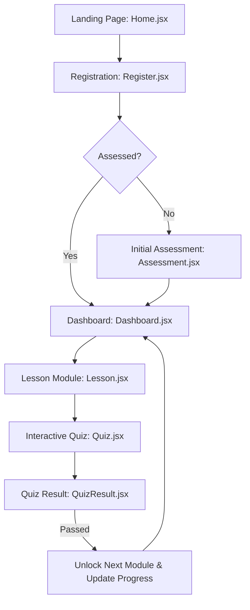

# 🌐 NetLearn — Internet Basics Learning Platform

> An intuitive, beginner-friendly, and interactive web application designed to empower first-time internet users and first-generation learners to master digital fundamentals with confidence.

---

## 📖 Overview

**NetLearn** bridges the digital literacy gap by breaking down complex internet concepts into everyday analogies, visual cards, and bite-sized interactive lessons. 

Unlike conventional tech courses filled with heavy jargon, NetLearn explains the internet through simple real-world comparisons (e.g. comparing the internet to an interconnected global road system, web browsers to submarines with windows, and search engines to ultra-fast librarians).

---

## ✨ Key Features

- **🌱 Initial Skill Assessment**:
  - 5-question baseline quiz that dynamically classifies learners into levels: *Starting Out*, *Beginner*, or *Confident Beginner*.
- **📚 4 Core Interactive Modules**:
  1. **Module 01: What is the Internet?** — Global network, devices, cables, Wi-Fi vs mobile data.
  2. **Module 02: Web Browsers** — Google Chrome, Edge, URLs, Address Bar, Tabs, Bookmarks.
  3. **Module 03: Search Engines** — Google, search keywords, evaluating results, spotting sponsored ads.
  4. **Module 04: Online Safety** — Bulletproof passwords, OTP security, HTTPS padlock, spotting scams.
- **🎯 Dynamic Quiz & Progress Engine**:
  - Interactive multiple-choice quizzes for each module.
  - Step-by-step lesson unlocking (passing a quiz automatically unlocks the next lesson and updates progress percentage on the dashboard).
- **📊 Real-time Dashboard**:
  - Live progress bar, completed lesson counts, current skill level badge, and quick quiz launcher.
- **🎨 Modern & Accessible UI**:
  - Clean, soothing visual aesthetic built with **Tailwind CSS v4** and modern typography (**Plus Jakarta Sans**).
  - Responsive across smartphones, tablets, and desktops.

---

## 🛠️ Tech Stack

### **Frontend (`client/`)**
- **Library**: [React 19](https://react.dev/)
- **Build Tool**: [Vite 8](https://vitejs.dev/)
- **Styling**: [Tailwind CSS v4](https://tailwindcss.com/) with `@tailwindcss/vite`
- **Routing**: [React Router](https://reactrouter.com/)
- **HTTP Client**: [Axios](https://axios-http.com/)
- **Typography**: Google Fonts (*Plus Jakarta Sans*)

### **Backend (`server/`)**
- **Runtime**: [Node.js](https://nodejs.org/) (ES Modules)
- **Framework**: [Express 5](https://expressjs.com/)
- **Database**: [MongoDB](https://www.mongodb.com/) via [Mongoose 9](https://mongoosejs.com/)
- **Utilities**: `dotenv`, `cors`, `nodemon`

---

## 📁 Project Structure

```text
Finalfirst generation/
├── client/                     # Frontend Application
│   ├── public/                 # Static assets & icons
│   ├── src/
│   │   ├── data/
│   │   │   └── lessonsData.js  # Lessons, analogies, and quizzes dataset
│   │   ├── pages/
│   │   │   ├── Home.jsx        # Landing page with hero & curriculum overview
│   │   │   ├── Register.jsx    # User onboarding & profile creation
│   │   │   ├── Assessment.jsx  # Initial baseline skill assessment
│   │   │   ├── Dashboard.jsx   # Personalized dashboard & learning roadmap
│   │   │   ├── Lesson.jsx      # Dynamic interactive lesson view
│   │   │   ├── Quiz.jsx        # Dynamic quiz runner
│   │   │   └── QuizResult.jsx  # Score breakdown & progress advancement
│   │   ├── App.jsx             # Route definitions
│   │   ├── index.css           # Tailwind CSS directives & global base styles
│   │   └── main.jsx            # React root mount
│   ├── index.html              # HTML shell & font imports
│   ├── package.json
│   └── vite.config.js          # Vite + Tailwind v4 config
│
├── server/                     # Backend REST API
│   ├── app/
│   │   └── app.js              # Express app, CORS, JSON middleware
│   ├── config/
│   │   └── db.js               # MongoDB connection helper
│   ├── models/
│   │   └── User.js             # User Mongoose schema & progress tracking
│   ├── routes/
│   │   └── userRoutes.js       # User, Assessment, Quiz & Progress endpoints
│   ├── .env                    # Environment variables (PORT, MONGO_URI)
│   ├── package.json
│   └── server.js               # Server entry point
│
└── README.md                   # Project documentation
```

---

## 🚀 Getting Started

### 1. Prerequisites
Ensure you have the following installed on your system:
- **Node.js** (v18.0.0 or higher recommended)
- **npm** (v9 or higher)
- **MongoDB** running locally on port `27017` (or a MongoDB Atlas connection URI)

---

### 2. Backend Setup (`server`)

1. Open a terminal and navigate to the `server` folder:
   ```bash
   cd server
   ```

2. Install dependencies:
   ```bash
   npm install
   ```

3. Create or verify the `.env` file in `server/`:
   ```env
   PORT=3000
   MONGO_URI=mongodb://localhost:27017/internet_basics
   ```

4. Start the backend development server:
   ```bash
   npm run dev
   ```
   *The server will start on `http://localhost:3000` with MongoDB connected.*

---

### 3. Frontend Setup (`client`)

1. Open a second terminal and navigate to the `client` folder:
   ```bash
   cd client
   ```

2. Install dependencies:
   ```bash
   npm install
   ```

3. Start the Vite development server:
   ```bash
   npm run dev
   ```
   *Vite will start the client on `http://localhost:5173`.*

4. Open your browser and navigate to:
   ```
   http://localhost:5173
   ```

---

## 📡 API Endpoints

All backend routes are prefixed with `/api/users`:

| Method | Endpoint | Description |
| :--- | :--- | :--- |
| `POST` | `/api/users` | Register a new user or login existing user by email |
| `GET` | `/api/users/:id` | Fetch complete user profile, assessment, and progress |
| `PATCH` | `/api/users/:id/assessment` | Save initial assessment score, total, and calculated level |
| `PATCH` | `/api/users/:id/progress` | Update `progress` percentage and `lessonsCompleted` count |
| `POST` | `/api/users/:id/quiz` | Record a completed quiz attempt with score and total |

### Example User Schema (`User.js`)
```json
{
  "_id": "67040...",
  "name": "Shruti Kesharwani",
  "email": "shruti@example.com",
  "assessment": {
    "score": 4,
    "total": 5,
    "level": "Confident Beginner"
  },
  "progress": 25,
  "lessonsCompleted": 1,
  "quizzes": [
    {
      "quizId": "internet-basics",
      "score": 5,
      "total": 5
    }
  ],
  "createdAt": "2026-10-07T...",
  "updatedAt": "2026-10-07T..."
}
```

---

## 🗺️ Application Journey / User Flow



---

## 🛡️ License

This project is licensed under the ISC License. Created for educational empowerment and digital inclusion.
